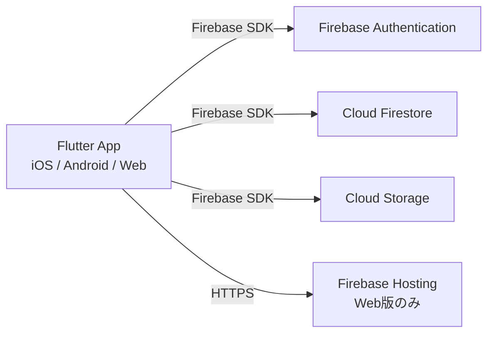

# インフラアーキテクチャ設計書

**Version**: 2.0
**Last Updated**: 2025-XX-XX
**Owner**: Architect Agent

## 1. 概要

本ドキュメントは、ライフプランアプリのバックエンドインフラのアーキテクチャを定義する。
インフラの構築・管理コストを最小限に抑えつつ、スケーラビリティとリアルタイム性を確保するため、Firebase (BaaS) を全面的に採用する。

> **MVP時点**: クライアントサイド処理で完結するサーバーレス構成。Cloud Functionsは不使用。

## 2. アーキテクチャ概要



## 3. 使用サービス詳細

### 3.1. Firebase Authentication
- **目的**: ユーザー認証管理（Phase 3で実装）
- **プロバイダ**: メール / パスワード
- **連携**: uid をDB・Storageのセキュリティキーとして使用

### 3.2. Cloud Firestore
- **目的**: ユーザー情報とイベントデータの永続化（Phase 3で実装）
- **ロケーション**: `asia-northeast1`（東京）
- **データモデル**:
  ```
  users/{userId}
     └ events/{eventId}
         ├ title: String
         ├ type: String ("Work" | "Private")
         ├ startDate: Timestamp
         ├ endDate: Timestamp?
         ├ detail: String?
         ├ iconType: String? (Workのみ: "join" | "career_up" | "goal")
         └ attachmentUrls: List<String>
  ```

### 3.3. Cloud Storage for Firebase
- **目的**: 画像・証明書ファイルの実体保存（Phase 3で実装）
- **ロケーション**: `asia-northeast1`（東京）
- **フォルダ構成**: `users/{userId}/events/{eventId}/{timestamp}.jpg`
- **クライアント制約**: アップロード前に `flutter_image_compress` で1MB以下に圧縮

### 3.4. Firebase Hosting
- **目的**: Flutter Web版の公開
- **特徴**: SSL自動適用、グローバルCDN配信

## 4. セキュリティ設計

「Deny-by-default（原則拒否）」を採用。認証済み本人以外のアクセスを遮断する。

### 4.1. Firestore ルール
```javascript
rules_version = '2';
service cloud.firestore {
  match /databases/{database}/documents {
    match /users/{userId}/{document=**} {
      allow read, write: if request.auth != null && request.auth.uid == userId;
    }
  }
}
```

### 4.2. Storage ルール
```javascript
rules_version = '2';
service firebase.storage {
  match /b/{bucket}/o {
    function isOwner(userId) {
      return request.auth != null && request.auth.uid == userId;
    }
    function isValidFile() {
      return request.resource.size < 5 * 1024 * 1024;
    }
    match /users/{userId}/{allPaths=**} {
      allow read: if isOwner(userId);
      allow write: if isOwner(userId) && isValidFile();
    }
  }
}
```

## 5. EDoS対策（クラウド破産防止）

1. **Hard Limit**: Storage Rules で5MB上限
2. **Soft Limit**: アプリ側で画像圧縮（1MB以下）
3. **Monitoring**: GCPコンソールで予算アラート設定

## 6. 既知の制限事項

- **オーファンファイル**: Firestoreのイベント削除時、Storageファイルは自動削除されない。個人利用範囲ではコスト影響が軽微なため許容。Cloud Functions導入時に `onDocumentDeleted` トリガーで対応予定。

## 7. デプロイ

```bash
firebase deploy
```

## 変更履歴

| バージョン | 日付 | 変更内容 |
|---|---|---|
| 1.0 | - | 初版作成 |
| 2.0 | - | Claude Code開発体制に合わせて再構成。Firestoreデータモデルに `detail`, `iconType` フィールド追加。 |
