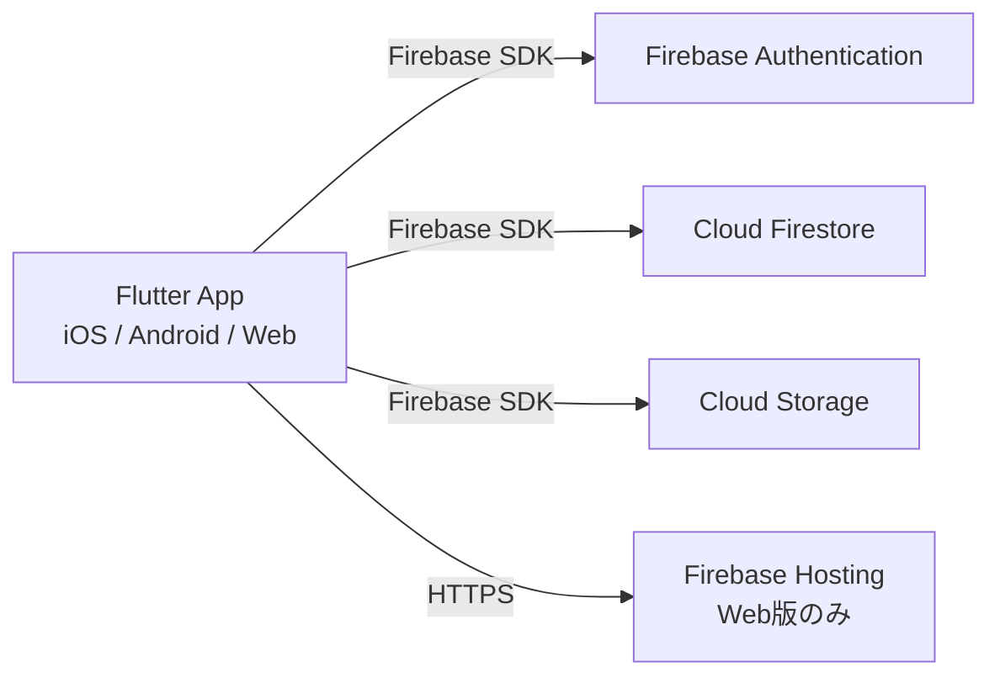

# インフラアーキテクチャ設計書

**Version**: 3.1
**Last Updated**: 2026-03-10
**Owner**: Architect Agent

## 1. 概要

本ドキュメントは、ライフプランアプリのバックエンドインフラのアーキテクチャを定義する。
インフラの構築・管理コストを最小限に抑えつつ、スケーラビリティとリアルタイム性を確保するため、Firebase (BaaS) を全面的に採用する。

> **MVP時点**: クライアントサイド処理で完結するサーバーレス構成。Cloud Functionsは不使用。
> 制約チェックロジックもクライアントサイドで実行するため、追加のインフラは不要。

## 2. アーキテクチャ概要



## 3. 使用サービス詳細

### 3.1. Firebase Authentication
- **目的**: ユーザー認証管理（Phase 3で実装）
- **プロバイダ**: メール / パスワード
- **連携**: uid をDB・Storageのセキュリティキーとして使用

### 3.2. Cloud Firestore
- **目的**: ユーザー情報とイベントデータの永続化（Phase 3で実装）
- **ロケーション**: `asia-northeast1`（東京）
- **データモデル**:

#### events コレクション
```
users/{userId}
   └ events/{eventId}
       ├ title: String
       ├ category: String (後述のEventCategory値)
       ├ status: String ("recorded" | "planned" | "goal" | "considering")
       ├ date: String (yyyy-MM)
       ├ endDate: String? (yyyy-MM)
       ├ description: String
       └ attachmentUrls: List<String>
```

#### category フィールドの値定義

`EventCategory` enum の各値に対応する。`isWork` は保存せず、アプリ側で enum から導出する。

| category 値 | isWork | 説明 |
|---|---|---|
| `joining` | true | 入社 |
| `jobChange` | true | 転職 |
| `promotion` | true | 昇進 |
| `retirement` | true | 退職 |
| `maternityLeave` | true | 産休 |
| `startup` | true | 起業 |
| `certification` | true | 資格取得 |
| `sideJob` | true | 副業開始 |
| `marriage` | false | 結婚 |
| `childbirth` | false | 出産 |
| `childcareLeave` | false | 育休 |
| `returnToWork` | false | 復職 |
| `moving` | false | 引越し |
| `travel` | false | 旅行 |
| `education` | false | 学び直し |
| `caregiving` | false | 介護 |

**設計判断 - subCategory / type / iconType フィールドの廃止と category への統合**:
- v3.0 では `type`（work/private）と `subCategory` の2フィールドでイベント種別を管理する方針だったが、実装では単一の `EventCategory` enum で仕事/プライベートの区分（`isWork`）とカテゴリの両方を表現している。
- Firestoreのフィールドも `category` 1フィールドに統合する。`isWork` の情報はアプリ側で `EventCategory.isWork` プロパティから導出するため、DBに保存する必要がない。
- 旧 `type` + `subCategory` 方式と比較して、フィールド数が削減され、データモデルがより簡潔になる。

**設計判断 - 制約チェック結果の非永続化**:
- 制約チェック結果（警告・情報メッセージ）はFirestoreに保存しない。
- 理由: 制約結果はイベント一覧から算出可能な導出データであり、イベント変更時の整合性維持コストが高い。MVP時点のイベント数（数十件規模）では毎回算出しても性能問題がない。
- セキュリティルールへの影響: なし（新規コレクション・フィールドを追加しないため）。

### 3.3. Cloud Storage for Firebase
- **目的**: 画像・証明書ファイルの実体保存（Phase 3で実装）
- **ロケーション**: `asia-northeast1`（東京）
- **フォルダ構成**: `users/{userId}/events/{eventId}/{timestamp}.jpg`
- **クライアント制約**: アップロード前に `flutter_image_compress` で1MB以下に圧縮

### 3.4. Firebase Hosting
- **目的**: Flutter Web版の公開
- **特徴**: SSL自動適用、グローバルCDN配信

## 4. セキュリティ設計

「Deny-by-default（原則拒否）」を採用。認証済み本人以外のアクセスを遮断する。

### 4.1. Firestore ルール
```javascript
rules_version = '2';
service cloud.firestore {
  match /databases/{database}/documents {
    match /users/{userId}/{document=**} {
      allow read, write: if request.auth != null && request.auth.uid == userId;
    }
  }
}
```

**category フィールドへの変更によるセキュリティルールへの影響**: なし。既存のワイルドカードルール（`{document=**}`）により、`events` サブコレクション内のフィールド変更は既存ルールでカバーされる。`category` はString型フィールドであり、既存のread/write制御の範囲内で処理される。

### 4.2. Storage ルール
```javascript
rules_version = '2';
service firebase.storage {
  match /b/{bucket}/o {
    function isOwner(userId) {
      return request.auth != null && request.auth.uid == userId;
    }
    function isValidFile() {
      return request.resource.size < 5 * 1024 * 1024;
    }
    match /users/{userId}/{allPaths=**} {
      allow read: if isOwner(userId);
      allow write: if isOwner(userId) && isValidFile();
    }
  }
}
```

## 5. EDoS対策（クラウド破産防止）

1. **Hard Limit**: Storage Rules で5MB上限
2. **Soft Limit**: アプリ側で画像圧縮（1MB以下）
3. **Monitoring**: GCPコンソールで予算アラート設定

## 6. 既知の制限事項

- **オーファンファイル**: Firestoreのイベント削除時、Storageファイルは自動削除されない。個人利用範囲ではコスト影響が軽微なため許容。Cloud Functions導入時に `onDocumentDeleted` トリガーで対応予定。

## 7. デプロイ

```bash
firebase deploy
```

## 変更履歴

| バージョン | 日付 | 変更内容 |
|---|---|---|
| 1.0 | - | 初版作成 |
| 2.0 | - | Claude Code開発体制に合わせて再構成。Firestoreデータモデルに `detail`, `iconType` フィールド追加。 |
| 3.0 | 2026-03-09 | イベントサブカテゴリ対応: `subCategory` フィールド追加、`iconType` フィールドを `subCategory` に統合。制約チェック結果の非永続化方針とその設計根拠を記載。セキュリティルールへの影響分析を追記。 |
| 3.1 | 2026-03-10 | Issue-001 対応: 実装との乖離を解消。Firestoreデータモデルを実装に合わせて更新 -- `type` + `subCategory` の2フィールド方式を `category` 単一フィールドに変更。`status`（EventStatus）、`date`/`endDate`（String yyyy-MM）、`description` フィールドを実装に合わせて反映。category値一覧を EventCategory enum の全16値に更新。 |
