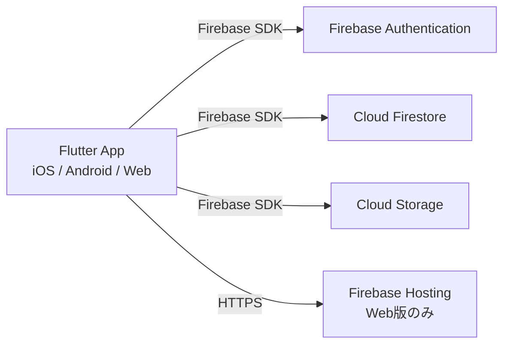

# Firebase アーキテクチャ設計書

**Version**: 7.0
**Last Updated**: 2026-05-12
**Owner**: Architect Agent

## 1. 概要

ライフプランアプリのバックエンドインフラを定義する。
インフラの構築・管理コストを最小限に抑えつつ、スケーラビリティとリアルタイム性を確保するため、Firebase (BaaS) を全面的に採用する。

> **MVP時点**: クライアントサイド処理で完結するサーバーレス構成。Cloud Functionsは不使用（ADR-005参照）。

## 2. アーキテクチャ概要



## 3. 使用サービス詳細

### 3.1. Firebase Authentication
- **目的**: ユーザー認証管理
- **プロバイダ**: **Google Sign-In のみ**（メール/パスワードは不使用）
- **連携**: uid をDB・Storageのセキュリティキーとして使用
- **ゲストモード**: 未認証でもUIの閲覧は可能。書き込み操作（イベント追加・編集・削除）時のみ認証を要求

#### プラットフォーム別実装

| プラットフォーム | 実装クラス | 認証方式 |
|---|---|---|
| Web | `WebAuthRepository` | `FirebaseAuth.signInWithPopup(GoogleAuthProvider)` |
| iOS / Android | `MobileAuthRepository` | `google_sign_in` パッケージ → `signInWithCredential` |

- 抽象インターフェース `AuthRepository` を通じてどちらの実装も共通コードから利用可能
- `kIsWeb` による実行時分岐で自動選択（`authRepositoryProvider`）

### 3.2. Cloud Firestore
- **目的**: ユーザープロフィール・イベントデータの永続化
- **ロケーション**: `asia-northeast1`（東京）

#### users ドキュメント
```
users/{userId}
   ├ name: String
   ├ birthDate: String? (yyyy-MM-dd)
   ├ updatedAt: Timestamp (サーバータイムスタンプ)
   └ (createdAt: Timestamp – 将来追加予定)
```

#### events コレクション（v7.0 で刷新）

```
users/{userId}
   └ events/{eventId}
       ├ id: String (UUID, ドキュメントID)
       ├ catalogId: String (規定ライフイベントのID。SPEC §4参照。ADR-010)
       ├ parentEventId: String? (マイルストーン用の親イベントID。ADR-011)
       ├ kind: String ("event" | "milestone"。ADR-011)
       ├ title: String (catalogIdのラベルを初期値とし、ユーザー編集可)
       ├ status: String ("recorded" | "planned" | "goal" | "considering")
       ├ date: String (yyyy-MM)
       ├ endDate: String? (yyyy-MM)
       ├ description: String
       ├ budgetYen: Number? (ユーザー上書き予算。null時はカタログのdefaultBudgetYenを表示。ADR-013)
       ├ goalId: String? (このイベントが属するゴールのID)
       └ isGoal: Boolean (このイベント自体がゴールかどうか)
```

**v6.0 → v7.0 のスキーマ変更**:

| フィールド | v6.0 | v7.0 | 説明 |
|---|---|---|---|
| `category` | String (EventCategory値) | **削除** | ADR-010: EventCategory enum 廃止 |
| `catalogId` | — | **追加** String | 規定カタログのID（kebab-case） |
| `parentEventId` | — | **追加** String? | マイルストーン用 |
| `kind` | — | **追加** String | "event" or "milestone" |
| `budgetYen` | — | **追加** Number? | ユーザー上書き予算 |

リリース前のため移行スクリプトは作成しない。`isWork` 情報はカタログ側の `LifeEventGroup` から導出する。

#### dependencies コレクション（ADR-003 / ADR-012）

```
users/{userId}
   └ dependencies/{dependencyId}
       ├ id: String
       ├ sourceEventId: String
       ├ targetEventId: String
       ├ type: String ("prerequisite" | "consequence" | "deadline" | "companion")
       ├ strength: String ("hard" | "soft")  ← v7.0 で追加（ADR-012）
       ├ offsetMonths: Number
       └ isAutoGenerated: Boolean
```

**`strength` フィールドの読み込み防御**:
v6.0 以前のドキュメントに `strength` が無い場合、Repository 層で読み込み時に既定値 `"soft"` を補う。

### 3.3. catalogId フィールドの値定義

`catalogId` は `docs/SPEC.md` §4 で定義された規定ライフイベントの ID を指す。
カタログ定義は **Firestore には保存しない**（ADR-004 / ADR-010 と同方針でアプリ内ハードコード）。

例: `wedding-ceremony`, `propose`, `pregnancy`, `job-change`, `purchase-home` など。
完全な一覧は `docs/SPEC.md` §4.2〜§4.8、または `lib/features/catalog/data/groups/` 配下のコードを参照。

### 3.4. Cloud Storage for Firebase
- **目的**: 画像・証明書ファイルの実体保存（将来構想）
- **ロケーション**: `asia-northeast1`（東京）
- **フォルダ構成**: `users/{userId}/events/{eventId}/{timestamp}.jpg`
- **クライアント制約**: アップロード前に `flutter_image_compress` で1MB以下に圧縮

### 3.5. Firebase Hosting
- **目的**: Flutter Web版の公開
- **特徴**: SSL自動適用、グローバルCDN配信

## 4. セキュリティ設計

「Deny-by-default（原則拒否）」を採用。認証済み本人以外のアクセスを遮断する。

### 4.1. Firestore ルール

v7.0 のスキーマ変更（`catalogId` / `parentEventId` / `kind` / `budgetYen` / `strength` 追加）でも、
**セキュリティルールに変更は不要**。既存の `users/{userId}/{document=**}` レベルの owner-only ルールが
追加フィールドも自動的にカバーする。

```javascript
rules_version = '2';
service cloud.firestore {
  match /databases/{database}/documents {
    match /users/{userId}/{document=**} {
      allow read, write: if request.auth != null && request.auth.uid == userId;
    }
  }
}
```

### 4.2. クライアント側バリデーション（必須）

セキュリティルールでは型レベル検証のみ。以下のビジネスルール検証は **クライアント側で必須**:

- `catalogId` は SPEC §4 で定義された ID のいずれか（カタログ整合性テストで担保）
- `parentEventId` が指す親イベントが存在する（孤児マイルストーン禁止）
- `parentEventId` の循環禁止（自分自身や子孫を親に指定できない）
- `kind == "milestone"` のとき `parentEventId` は非null必須
- `budgetYen` は非負整数

### 4.3. Storage ルール
```javascript
rules_version = '2';
service firebase.storage {
  match /b/{bucket}/o {
    function isOwner(userId) {
      return request.auth != null && request.auth.uid == userId;
    }
    function isValidFile() {
      return request.resource.size < 5 * 1024 * 1024;
    }
    match /users/{userId}/{allPaths=**} {
      allow read: if isOwner(userId);
      allow write: if isOwner(userId) && isValidFile();
    }
  }
}
```

## 5. EDoS対策（クラウド破産防止）

1. **Hard Limit**: Storage Rules で5MB上限
2. **Soft Limit**: アプリ側で画像圧縮（1MB以下）
3. **Monitoring**: GCPコンソールで予算アラート設定

## 6. 既知の制限事項

- **オーファンファイル**: Firestoreのイベント削除時、Storageファイルは自動削除されない。個人利用範囲ではコスト影響が軽微なため許容。Cloud Functions導入時に `onDocumentDeleted` トリガーで対応予定。
- **孤児マイルストーン**: 親イベント削除時、子マイルストーンを連動削除するロジックはクライアント側で実装する（ADR-011）。

## 7. デプロイ

```bash
firebase deploy
```

## 変更履歴

| バージョン | 日付 | 変更内容 |
|---|---|---|
| 1.0 | - | 初版作成 |
| 2.0 | - | Firestoreデータモデルに `detail`, `iconType` フィールド追加 |
| 3.0 | 2026-03-09 | イベントサブカテゴリ対応 |
| 3.1 | 2026-03-10 | `category` 単一フィールドに統合 |
| 4.0 | 2026-03-25 | events に id/goalId/isGoal、dependencies コレクション新設 |
| 5.0 | 2026-03-27 | ファイル名を FIREBASE_ARCHITECTURE.md にリネーム |
| 6.0 | 2026-03-29 | Googleログイン専用、usersドキュメント追加 |
| 7.0 | 2026-05-12 | 規定ライフイベントカタログD&D方式へのピボット（PDR-005）。events から `category` を削除し `catalogId` / `parentEventId` / `kind` / `budgetYen` を追加。dependencies に `strength` を追加。スキーマ変更でもセキュリティルールは変更不要 |
