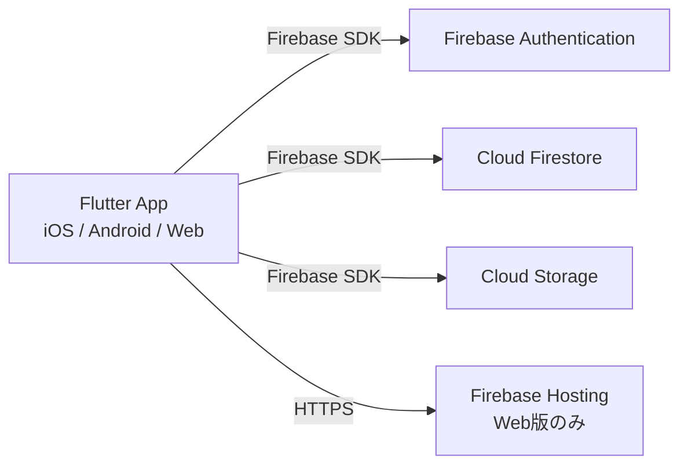

# Firebase アーキテクチャ設計書

**Version**: 6.0
**Last Updated**: 2026-03-29
**Owner**: Architect Agent

## 1. 概要

ライフプランアプリのバックエンドインフラを定義する。
インフラの構築・管理コストを最小限に抑えつつ、スケーラビリティとリアルタイム性を確保するため、Firebase (BaaS) を全面的に採用する。

> **MVP時点**: クライアントサイド処理で完結するサーバーレス構成。Cloud Functionsは不使用（ADR-005参照）。

## 2. アーキテクチャ概要



## 3. 使用サービス詳細

### 3.1. Firebase Authentication
- **目的**: ユーザー認証管理
- **プロバイダ**: **Google Sign-In のみ**（メール/パスワードは不使用）
- **連携**: uid をDB・Storageのセキュリティキーとして使用
- **ゲストモード**: 未認証でもUIの閲覧は可能。書き込み操作（イベント追加・編集・削除）時のみ認証を要求

#### プラットフォーム別実装

| プラットフォーム | 実装クラス | 認証方式 |
|---|---|---|
| Web | `WebAuthRepository` | `FirebaseAuth.signInWithPopup(GoogleAuthProvider)` |
| iOS / Android | `MobileAuthRepository` | `google_sign_in` パッケージ → `signInWithCredential` |

- 抽象インターフェース `AuthRepository` を通じてどちらの実装も共通コードから利用可能
- `kIsWeb` による実行時分岐で自動選択（`authRepositoryProvider`）

### 3.2. Cloud Firestore
- **目的**: ユーザープロフィール・イベントデータの永続化
- **ロケーション**: `asia-northeast1`（東京）

#### users ドキュメント（新規追加）
```
users/{userId}
   ├ name: String
   ├ birthDate: String? (yyyy-MM-dd)
   ├ updatedAt: Timestamp (サーバータイムスタンプ)
   └ (createdAt: Timestamp – 将来追加予定)
```

#### events コレクション
```
users/{userId}
   └ events/{eventId}
       ├ id: String (UUID, ドキュメントID)
       ├ title: String
       ├ category: String (EventCategory値。ADR-001参照)
       ├ status: String ("recorded" | "planned" | "goal" | "considering")
       ├ date: String (yyyy-MM)
       ├ endDate: String? (yyyy-MM)
       ├ description: String
       ├ goalId: String? (このイベントが属するゴールのID)
       └ isGoal: Boolean (このイベント自体がゴールかどうか)
```

#### dependencies コレクション（ADR-003参照）
```
users/{userId}
   └ dependencies/{dependencyId}
       ├ id: String
       ├ sourceEventId: String
       ├ targetEventId: String
       ├ offsetMonths: Number
       └ isAutoGenerated: Boolean
```

#### category フィールドの値定義

`EventCategory` enum の各値に対応する。`isWork` は保存せず、アプリ側で enum から導出する（ADR-001参照）。カテゴリの表示属性（アイコン・カラー）は `docs/SPEC.md` を参照。

| category 値 | isWork |
|---|---|
| `joining` | true |
| `jobChange` | true |
| `promotion` | true |
| `retirement` | true |
| `maternityLeave` | true |
| `startup` | true |
| `certification` | true |
| `sideJob` | true |
| `marriage` | false |
| `childbirth` | false |
| `childcareLeave` | false |
| `returnToWork` | false |
| `moving` | false |
| `travel` | false |
| `education` | false |
| `caregiving` | false |

### 3.3. Cloud Storage for Firebase
- **目的**: 画像・証明書ファイルの実体保存（Phase 3で実装）
- **ロケーション**: `asia-northeast1`（東京）
- **フォルダ構成**: `users/{userId}/events/{eventId}/{timestamp}.jpg`
- **クライアント制約**: アップロード前に `flutter_image_compress` で1MB以下に圧縮

### 3.4. Firebase Hosting
- **目的**: Flutter Web版の公開
- **特徴**: SSL自動適用、グローバルCDN配信

## 4. セキュリティ設計

「Deny-by-default（原則拒否）」を採用。認証済み本人以外のアクセスを遮断する。

### 4.1. Firestore ルール
```javascript
rules_version = '2';
service cloud.firestore {
  match /databases/{database}/documents {
    match /users/{userId}/{document=**} {
      allow read, write: if request.auth != null && request.auth.uid == userId;
    }
  }
}
```

### 4.2. Storage ルール
```javascript
rules_version = '2';
service firebase.storage {
  match /b/{bucket}/o {
    function isOwner(userId) {
      return request.auth != null && request.auth.uid == userId;
    }
    function isValidFile() {
      return request.resource.size < 5 * 1024 * 1024;
    }
    match /users/{userId}/{allPaths=**} {
      allow read: if isOwner(userId);
      allow write: if isOwner(userId) && isValidFile();
    }
  }
}
```

## 5. EDoS対策（クラウド破産防止）

1. **Hard Limit**: Storage Rules で5MB上限
2. **Soft Limit**: アプリ側で画像圧縮（1MB以下）
3. **Monitoring**: GCPコンソールで予算アラート設定

## 6. 既知の制限事項

- **オーファンファイル**: Firestoreのイベント削除時、Storageファイルは自動削除されない。個人利用範囲ではコスト影響が軽微なため許容。Cloud Functions導入時に `onDocumentDeleted` トリガーで対応予定。

## 7. デプロイ

```bash
firebase deploy
```

## 変更履歴

| バージョン | 日付 | 変更内容 |
|---|---|---|
| 1.0 | - | 初版作成 |
| 2.0 | - | Firestoreデータモデルに `detail`, `iconType` フィールド追加 |
| 3.0 | 2026-03-09 | イベントサブカテゴリ対応。制約チェック結果の非永続化方針を記載 |
| 3.1 | 2026-03-10 | `type` + `subCategory` 2フィールド方式を `category` 単一フィールドに変更 |
| 4.0 | 2026-03-25 | events コレクションに id/goalId/isGoal フィールドを追加。dependencies コレクションを新設 |
| 5.0 | 2026-03-27 | ファイル名を ARCHITECTURE.md から FIREBASE_ARCHITECTURE.md に変更。設計判断ブロックをADR（docs/adr/）に移管 |
| 6.0 | 2026-03-29 | 認証方式をGoogleログイン専用に変更。usersドキュメントのスキーマ追加。プラットフォーム別実装の差異を記載 |
