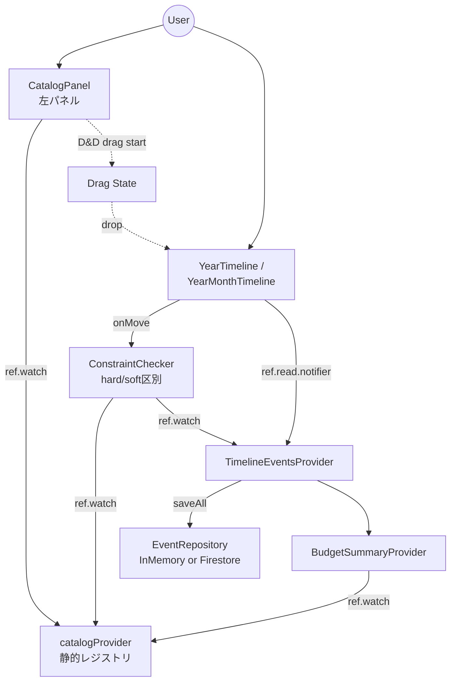
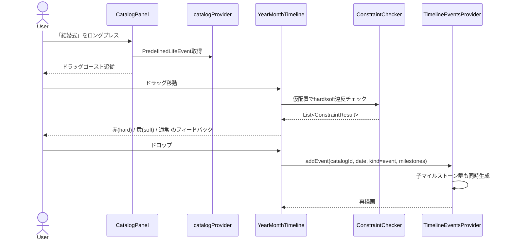

# ソフトウェアアーキテクチャ設計書

**Version**: 6.0
**Last Updated**: 2026-05-12
**Owner**: Architect Agent

## 1. 概要

本文書は、ライフプランアプリのソフトウェアアーキテクチャを定義する。
高いメンテナンス性、テスト容易性、拡張性を確保し、AIコーディングエージェントによる開発支援を効率化することを設計目標とする。

## 2. 設計思想

- **アーキテクチャスタイル**: レイヤードアーキテクチャ（3層）
- **設計原則**: 関心の分離（Separation of Concerns）
- **層構成**: Presentation（UI）→ Logic → Data
- **静的データの扱い**: ゴールテンプレート（ADR-004）および規定ライフイベントカタログ（ADR-010）は
  Firestoreに保存せずアプリ内にハードコードする。

## 3. 技術スタック

> 詳細は `CLAUDE.md` セクション3を参照。

| 技術 | 選定理由 |
|---|---|
| Riverpod v2 + Generator | コンパイル時のProvider型安全性。AIエージェントがコード生成しやすいアノテーションベース |
| GoRouter | 宣言的ルーティング。Deep Link対応。Web対応が容易 |
| Freezed | イミュータブルなデータモデル。copyWith / == / toString の自動生成 |
| mocktail | コード生成不要のモックライブラリ |

## 4. レイヤー定義

### 4.1. Presentation層（UI Layer）
- **責務**: 画面描画とユーザー入力受付のみ
- **構成**: `ConsumerWidget` / `ConsumerStatefulWidget`
- **ルール**:
  - `ref.watch()` でLogic層の状態を購読
  - ユーザー操作は `ref.read(provider.notifier).method()` でLogic層に通知
  - ビジネスロジックを一切持たない

### 4.2. Logic層（Business Logic Layer）
- **責務**: 状態管理とビジネスロジック実行
- **構成**: `@riverpod` アノテーションで生成されるProvider群
- **ルール**:
  - UI層からの通知を受け、Data層のRepositoryを呼び出す
  - 制約チェックのような導出ロジックは純粋関数Providerとして実装

### 4.3. Data層（Data Layer）
- **責務**: 外部データソースとのI/O
- **構成**: Repositoryクラス + Provider
- **ルール**:
  - リポジトリパターンを実装
  - 認証状態に応じてInMemory実装とFirestore実装を切替（既存 Phase 3 で実装済み）

### 4.4. Catalog層の位置づけ（v6.0 で新設）

規定ライフイベントカタログは **`lib/features/catalog/` という新規 feature** として配置する。

**選定理由**:

| 選択肢 | Pros | Cons | 採否 |
|---|---|---|---|
| `lib/features/timeline/data/` 内に置く | Timeline機能との一体感 | カタログは timeline 以外（goal_template / budget_summary 等）からも参照される。timeline の中に置くと依存逆転が起きる | 不採用 |
| `lib/core/catalog/` に置く | アプリ横断的な静的データとして配置 | core はインフラ寄り（router/theme/constants）の場所。ドメイン色の強いカタログは合わない | 不採用 |
| **`lib/features/catalog/` を新設** | feature 単位で domain / data / logic / presentation のレイヤーが揃う。timeline と並列のため依存方向が明確 | feature が一つ増える | **採用** |

## 5. ディレクトリ構造

```
lib/
├── main.dart
├── core/
│   ├── router/
│   ├── theme/
│   └── constants/
└── features/
    ├── catalog/                                   # ★v6.0 新設
    │   ├── domain/
    │   │   ├── predefined_life_event.dart         # 規定イベント型
    │   │   ├── life_event_group.dart              # enum LifeEventGroup
    │   │   ├── hard_precedence.dart               # hard 先行ルール
    │   │   ├── soft_precedence.dart               # soft 先行ルール
    │   │   ├── milestone_template.dart            # 既定マイルストーン
    │   │   └── event_kind.dart                    # enum EventKind (event/milestone)
    │   ├── data/
    │   │   ├── predefined_catalog_registry.dart   # 全グループ集約レジストリ
    │   │   └── groups/                            # ★グループ別ファイル分割
    │   │       ├── marriage_events.dart           # 結婚 11件
    │   │       ├── childbirth_events.dart         # 出産 7件
    │   │       ├── career_events.dart             # キャリア 7件
    │   │       ├── lifestyle_events.dart          # 住まい 5件
    │   │       ├── travel_events.dart             # 旅行 4件
    │   │       ├── learning_events.dart           # 学び 3件
    │   │       └── money_events.dart              # お金 3件
    │   ├── logic/
    │   │   ├── catalog_provider.dart              # グループ別取得・検索Provider
    │   │   └── catalog_lookup_provider.dart       # catalogId → PredefinedLifeEvent 引き当て
    │   └── presentation/
    │       ├── catalog_panel.dart                 # 左パネル本体
    │       └── widgets/
    │           ├── catalog_group_section.dart     # グループ別折りたたみセクション
    │           └── catalog_item_tile.dart         # ドラッグ可能な項目
    ├── timeline/
    │   ├── data/
    │   │   ├── event_repository.dart                       # InMemory実装
    │   │   ├── firestore_event_repository.dart             # Firestore実装
    │   │   ├── dependency_repository.dart
    │   │   ├── firestore_dependency_repository.dart
    │   │   └── goal_template_data.dart                     # ★v6.0: catalogId参照に書き換え
    │   ├── domain/
    │   │   ├── life_event.dart                             # ★v6.0: catalogId/parentEventId/kind/budgetYen追加、EventCategory削除
    │   │   ├── constraint_result.dart
    │   │   ├── event_dependency.dart                       # ★v6.0: strength追加
    │   │   ├── dependency_strength.dart                    # ★v6.0新規: enum DependencyStrength
    │   │   └── goal_template.dart                          # ★v6.0: TemplateEvent.catalogId参照
    │   ├── logic/
    │   │   ├── timeline_events_provider.dart
    │   │   ├── constraint_checker_provider.dart            # ★v6.0: hard/soft区別、カタログ静的ルール統合
    │   │   ├── dependency_provider.dart
    │   │   ├── goal_template_provider.dart
    │   │   ├── cascade_move_provider.dart                  # ★v6.0: 親移動時の子マイルストーン追従
    │   │   └── budget_summary_provider.dart                # ★v6.0新規: 合計予算算出
    │   └── presentation/
    │       ├── timeline_screen.dart                        # ★v6.0: 左パネル統合
    │       ├── goal_setup_dialog.dart
    │       ├── edit_event_dialog.dart                      # ★v6.0: 旧 AddEventDialog を編集専用に縮約
    │       └── widgets/
    │           ├── year_timeline.dart                      # ★v6.0: カタログからのドロップ受付
    │           ├── year_month_timeline.dart                # ★v6.0: 同上
    │           ├── event_card.dart                         # ★v6.0: 予算表示行追加
    │           ├── milestone_chip.dart                     # ★v6.0新規: 親直下の子マイルストーン
    │           ├── constraint_warning.dart                 # ★v6.0: hard/soft 色分け
    │           ├── dependency_connector.dart
    │           ├── event_style.dart                        # ★v6.0: catalogColor/catalogIcon
    │           └── budget_summary_chip.dart                # ★v6.0新規: AppBar右に表示
    ├── auth/
    └── user_profile/

test/
└── features/
    ├── catalog/                                            # ★v6.0新設
    │   ├── data/
    │   │   └── catalog_consistency_test.dart               # ★必須: ID一意性 / predecessor孤立参照禁止検証
    │   ├── domain/
    │   │   └── predefined_life_event_test.dart
    │   └── logic/
    │       └── catalog_provider_test.dart
    ├── timeline/
    │   ├── data/
    │   ├── domain/
    │   │   ├── life_event_test.dart                        # ★v6.0: 新フィールドのテスト追加
    │   │   └── event_dependency_test.dart                  # ★v6.0: strength のテスト追加
    │   ├── logic/
    │   │   ├── constraint_checker_provider_test.dart       # ★v6.0: hard/soft 区別テスト
    │   │   ├── cascade_move_provider_test.dart             # ★v6.0: マイルストーン追従テスト
    │   │   └── budget_summary_provider_test.dart           # ★v6.0新規
    │   └── presentation/
    └── auth/
```

### 5.1. グループ別ファイル分割の方針

`lib/features/catalog/data/groups/` 以下は **グループごとに独立した Dart ファイル** に分割する。

- ファイル名: `{group}_events.dart`（例: `marriage_events.dart`）
- 各ファイルは `List<PredefinedLifeEvent> get marriageEvents` のような static getter を公開
- `predefined_catalog_registry.dart` で全ファイルを import し `List<PredefinedLifeEvent> get all` で集約

**理由**:

1. **AIエージェントが安全に編集できる粒度**: 1グループ = 1ファイルなら、Claude / Codex 等が
   「結婚イベントを追加する」「子育てイベントを修正する」タスクを **局所的な変更** として実行できる。
2. **コンフリクト最小化**: 複数人 / 複数エージェントが同時にカタログを編集してもファイル単位で分かれていれば衝突しにくい。
3. **スキーマ違反防止**: 各 group ファイルの先頭に「`PredefinedLifeEvent` のスキーマ説明 + 1件分の完全記述例 +
   hard/soft ルールの書き方」を **Dartdoc コメント** として埋め込む。これにより AI が後から追加・編集する際に
   スキーマ違反を起こしにくくする。
4. **CI 必須テスト**: `test/features/catalog/data/catalog_consistency_test.dart` で
   「全カタログのIDが一意」「hardRules / softRules が参照する predecessorCatalogId が実在」
   「milestoneTemplates の offset が整数月」「重複ラベル無し」などを検証する。

### 5.2. Riverpod 構造の更新

```
ProviderScope
├─ catalogProvider              (List<PredefinedLifeEvent>; static)
├─ catalogByGroupProvider       (Map<LifeEventGroup, List<PredefinedLifeEvent>>)
├─ catalogLookupProvider        (Map<String catalogId, PredefinedLifeEvent>)
├─ timelineEventsProvider       (AsyncNotifier<List<LifeEvent>>)
├─ dependencyProvider           (AsyncNotifier<List<EventDependency>>)
├─ constraintCheckerProvider    (List<ConstraintResult>; ref.watch(timeline) + ref.watch(catalog))
├─ cascadeMoveProvider          (pure function)
├─ goalTemplateProvider         (Notifier<List<GoalTemplate>>)
└─ budgetSummaryProvider        (int; ref.watch(timeline) + ref.watch(catalog))
```

`catalogProvider` 系は **副作用なし・即時取得可能な定数Provider**。
`constraintCheckerProvider` と `budgetSummaryProvider` は両方とも `timelineEvents` と `catalog` を watch する。

## 6. データフロー図

### 6.1. ピボット後のコンポーネント図



### 6.2. カタログD&Dシーケンス



### 6.3. マイルストーン追従カスケード移動


## 7. 主要モデル定義（参考）

### 7.1. PredefinedLifeEvent（v6.0 新設）

```dart
// predefined_life_event.dart
@immutable
class PredefinedLifeEvent {
  final String id;                              // 例: 'wedding-ceremony'
  final String label;                           // '結婚式'
  final LifeEventGroup group;                   // marriage/childbirth/...
  final IconData icon;
  final Color color;
  final int? defaultDurationMonths;
  final int? defaultBudgetYen;                  // 中央値 (ADR-013)
  final List<HardPrecedence> hardRules;
  final List<SoftPrecedence> softRules;
  final List<MilestoneTemplate> milestoneTemplates;
  const PredefinedLifeEvent({ ... });
}

enum LifeEventGroup {
  marriage('結婚'),
  childbirth('出産'),
  career('キャリア'),
  lifestyle('住まい'),
  travel('旅行'),
  learning('学び'),
  money('お金');
  const LifeEventGroup(this.label);
  final String label;
}

class HardPrecedence {
  final String predecessorCatalogId;
  final int? minMonthsAfter;
  final String message;
  const HardPrecedence({...});
}

class SoftPrecedence {
  final String predecessorCatalogId;
  final int recommendedMinMonthsAfter;
  final String message;
  const SoftPrecedence({...});
}

class MilestoneTemplate {
  final String label;
  final int offsetMonthsFromParent;       // 負=前、正=後
  final int? defaultBudgetYen;
  const MilestoneTemplate({...});
}
```

### 7.2. LifeEvent（v6.0 改訂）

```dart
@immutable
class LifeEvent {
  final String id;                  // UUID
  final String catalogId;           // ★v6.0: EventCategory置換
  final String? parentEventId;      // ★v6.0新規: マイルストーン用
  final EventKind kind;             // ★v6.0新規: event | milestone
  final String date;                // yyyy-MM
  final String? endDate;
  final String title;               // catalogId.label を初期値、ユーザー編集可
  final String description;
  final EventStatus status;
  final int? budgetYen;             // ★v6.0新規 (ADR-013)
  final String? goalId;
  final bool isGoal;
  const LifeEvent({...});
}

enum EventKind { event, milestone }
```

**v5.0 → v6.0 の変更点**:
- `category: EventCategory` を **削除**（ADR-010）
- `catalogId: String` を **追加**
- `parentEventId: String?` を **追加**（ADR-011）
- `kind: EventKind` を **追加**（ADR-011）
- `budgetYen: int?` を **追加**（ADR-013）

### 7.3. EventDependency（v6.0 改訂）

```dart
@immutable
class EventDependency {
  final String id;
  final String sourceEventId;
  final String targetEventId;
  final DependencyType type;
  final DependencyStrength strength;   // ★v6.0新規 (ADR-012)
  final int offsetMonths;
  final bool isAutoGenerated;
  const EventDependency({...});
}

enum DependencyStrength { hard, soft }
```

### 7.4. ConstraintCheckerProvider（v6.0 改訂）

```dart
@riverpod
List<ConstraintResult> constraintChecker(ConstraintCheckerRef ref) {
  final eventsAsync = ref.watch(timelineEventsProvider);
  final catalog = ref.watch(catalogLookupProvider);
  return eventsAsync.when(
    data: (events) => _checkAllConstraints(events, catalog),
    loading: () => [],
    error: (_, __) => [],
  );
}

/// 各 LifeEvent の catalogId からカタログ静的ルール（hard/soft）を引き、
/// 配置済みの先行イベントとの前後関係を検証する。
List<ConstraintResult> _checkAllConstraints(
  List<LifeEvent> events,
  Map<String, PredefinedLifeEvent> catalog,
);
```

ConstraintResult には `strength: DependencyStrength` を追加し、UI 側で hard = 赤、soft = 黄で描画する。

### 7.5. BudgetSummaryProvider（v6.0 新設）

```dart
@riverpod
int budgetSummary(BudgetSummaryRef ref) {
  final eventsAsync = ref.watch(timelineEventsProvider);
  final catalog = ref.watch(catalogLookupProvider);
  return eventsAsync.maybeWhen(
    data: (events) => events.fold<int>(0, (sum, e) {
      final preset = catalog[e.catalogId]?.defaultBudgetYen ?? 0;
      return sum + (e.budgetYen ?? preset);
    }),
    orElse: () => 0,
  );
}
```

## 変更履歴

| バージョン | 日付 | 変更内容 |
|---|---|---|
| 1.0 | - | 初版作成 |
| 2.0 | - | AI開発効率化を設計目標に追加 |
| 3.0 | - | Claude Code体制に合わせて再構成 |
| 4.0 | 2026-03-09 | EventSubCategory enum、ConstraintResult、ConstraintChecker追加 |
| 4.1 | 2026-03-10 | 単一EventCategory enum方式に変更 |
| 5.0 | 2026-03-26 | 目標逆算機能対応 |
| 6.0 | 2026-05-12 | 規定ライフイベントカタログD&D方式へのピボット（PDR-005）。`lib/features/catalog/` 新設、グループ別ファイル分割方針を明記。LifeEventからEventCategory削除、catalogId/parentEventId/kind/budgetYen追加。EventDependencyにstrength追加。BudgetSummaryProvider新設。Riverpod構造更新 |
