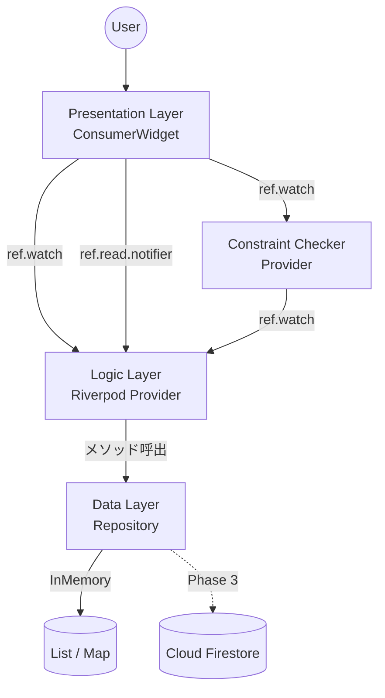
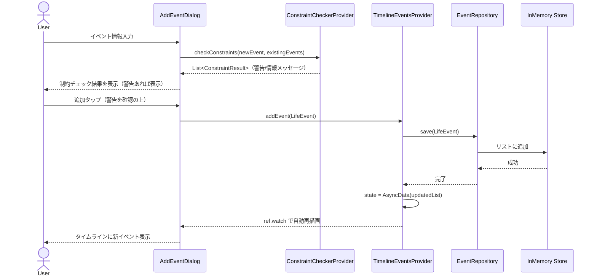
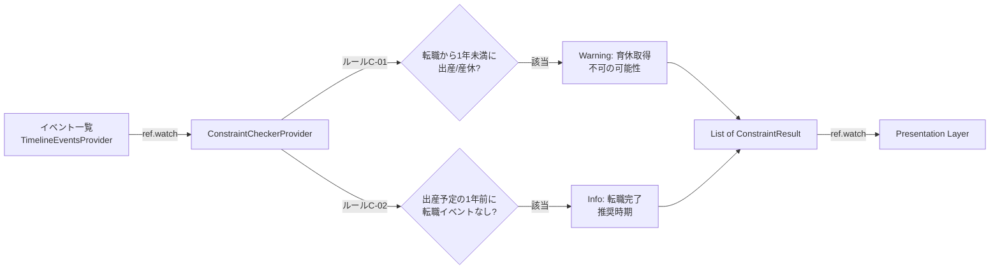

# ソフトウェアアーキテクチャ設計書

**Version**: 4.1
**Last Updated**: 2026-03-10
**Owner**: Architect Agent

## 1. 概要

本文書は、ライフプランアプリのソフトウェアアーキテクチャを定義する。
高いメンテナンス性、テスト容易性、拡張性を確保し、AIコーディングエージェントによる開発支援を効率化することを設計目標とする。

## 2. 設計思想

- **アーキテクチャスタイル**: レイヤードアーキテクチャ（3層）
- **設計原則**: 関心の分離（Separation of Concerns）
- **層構成**: Presentation（UI）→ Logic → Data

## 3. 技術スタック

> 詳細は `CLAUDE.md` セクション3を参照。ここでは設計に関わる選定理由を記述する。

| 技術 | 選定理由 |
|---|---|
| Riverpod v2 + Generator | コンパイル時のProvider型安全性。AIエージェントがコード生成しやすいアノテーションベース。 |
| GoRouter | 宣言的ルーティング。Deep Link対応。Web対応が容易。 |
| Freezed | イミュータブルなデータモデル。copyWith / == / toString の自動生成。 |
| mocktail | コード生成不要のモックライブラリ。AIエージェントとの相性良好。 |

## 4. レイヤー定義

### 4.1. Presentation層（UI Layer）
- **責務**: 画面描画とユーザー入力受付のみ。
- **構成**: `ConsumerWidget` / `ConsumerStatefulWidget`
- **ルール**:
  - `ref.watch()` でLogic層の状態を購読しUIを描画する。
  - ユーザー操作は `ref.read(provider.notifier).method()` でLogic層に通知する。
  - **ビジネスロジック（計算、データ通信、状態加工）を一切持たない。**

### 4.2. Logic層（Business Logic Layer）
- **責務**: 状態管理とビジネスロジック実行。
- **構成**: `@riverpod` アノテーションで生成されるProvider群
  - `AsyncNotifierProvider`: 非同期データ + ユーザー操作ロジック
  - `NotifierProvider`: 同期的な状態管理
  - **純粋関数Provider**: 導出データの計算（制約チェック等）
- **ルール**:
  - UI層からの通知を受け、Data層のRepositoryを呼び出す。
  - Repositoryから受け取ったデータをUIが表示しやすい状態モデルに加工する。
  - 制約チェックのような導出ロジックは、副作用を持たない純粋関数として実装する。

### 4.3. Data層（Data Layer）
- **責務**: 外部データソースとのI/O。
- **構成**: Repositoryクラス + Provider
- **ルール**:
  - リポジトリパターンを実装する。
  - データ取得元の実装詳細をLogic層から隠蔽する。
  - MVP時はインメモリ実装。Phase 3でFirestore実装に差し替え。

## 5. ディレクトリ構造

```
lib/
├── main.dart                           # エントリポイント + ProviderScope
├── core/
│   ├── router/
│   │   └── app_router.dart             # GoRouter設定
│   ├── theme/
│   │   └── app_theme.dart              # ThemeData定義
│   └── constants/
│       └── app_constants.dart          # 文字数上限等の定数
└── features/
    ├── timeline/
    │   ├── data/
    │   │   └── event_repository.dart   # Repository（MVP: InMemory実装）
    │   ├── domain/
    │   │   ├── life_event.dart         # データモデル + EventCategory enum
    │   │   └── constraint_result.dart  # @freezed 制約チェック結果モデル
    │   ├── logic/
    │   │   ├── timeline_events_provider.dart     # @riverpod 状態管理
    │   │   └── constraint_checker_provider.dart  # @riverpod 制約チェックロジック
    │   └── presentation/
    │       ├── timeline_screen.dart    # メイン画面
    │       └── widgets/
    │           ├── timeline_view.dart  # タイムライン描画
    │           ├── event_card.dart     # イベントカード
    │           ├── add_event_dialog.dart # イベント追加ダイアログ
    │           └── constraint_warning.dart # 制約警告表示ウィジェット
    └── profile/
        ├── data/
        │   └── profile_repository.dart
        ├── domain/
        │   └── user_profile.dart       # @freezed データモデル
        ├── logic/
        │   └── profile_provider.dart
        └── presentation/
            └── profile_dialog.dart

test/
└── features/
    ├── timeline/
    │   ├── data/
    │   │   └── event_repository_test.dart
    │   ├── logic/
    │   │   ├── timeline_events_provider_test.dart
    │   │   └── constraint_checker_provider_test.dart
    │   └── presentation/
    │       └── constraint_warning_test.dart
    └── profile/
```

## 6. データフロー図

### 6.1. コンポーネント図



### 6.2. イベント追加シーケンス（制約チェック付き）



### 6.3. 制約チェックのデータフロー



## 7. 主要モデル定義（参考）

### 7.1. EventCategory enum（実装済み）

```dart
// life_event.dart

/// イベントカテゴリ
/// 仕事系とプライベート系に分類される
enum EventCategory {
  // 仕事系
  joining('入社', true),
  jobChange('転職', true),
  promotion('昇進', true),
  retirement('退職', true),
  maternityLeave('産休', true),
  startup('起業', true),
  certification('資格取得', true),
  sideJob('副業開始', true),
  // プライベート系
  marriage('結婚', false),
  childbirth('出産', false),
  childcareLeave('育休', false),
  returnToWork('復職', false),
  moving('引越し', false),
  travel('旅行', false),
  education('学び直し', false),
  caregiving('介護', false);

  const EventCategory(this.label, this.isWork);
  final String label;
  final bool isWork;
}
```

**設計判断 - 単一 EventCategory enum を採用した理由**:

v4.0 では `WorkSubCategory` と `PrivateSubCategory` の2つの独立した enum に分離する方針を定めた。しかし実装時に以下の理由から、既存の `EventCategory` 単一 enum を拡張する方式に変更した（PM判断、audit_log 2026-03-09 参照）。

1. **後方互換性**: 既存の `EventCategory` は `isWork` プロパティで仕事/プライベートを区別しており、2 enum 方式と機能的に等価である。既存コード（LifeEvent, EventRepository, Provider, UI, テスト全15+件）がすべて `EventCategory` に依存しており、2 enum へのリファクタリングは大量の破壊的変更を伴う。
2. **変更の最小化**: 既存の `EventCategory` には設計で必要なカテゴリの大半が既に存在し、不足していたのは `maternityLeave`（産休）のみであった。1値の追加で要件を満たせるため、コスト対効果の観点から単一 enum 拡張が合理的と判断した。
3. **型安全性の担保**: `isWork` プロパティにより、各カテゴリが仕事系かプライベート系かは enum 定義内で静的に決定される。2 enum 方式ほどの厳密なコンパイル時チェックはないが、実用上は `isWork` フラグによる分岐で十分な安全性を確保できる。

### 7.2. LifeEvent モデル

```dart
// life_event.dart
@immutable
class LifeEvent {
  final String date;           // yyyy-MM
  final String? endDate;       // yyyy-MM
  final String title;
  final String description;
  final EventCategory category;
  final EventStatus status;

  const LifeEvent({
    required this.date,
    this.endDate,
    required this.title,
    required this.description,
    required this.category,
    this.status = EventStatus.recorded,
  });

  // 導出プロパティ
  DateTime get dateTime { /* date を DateTime に変換 */ }
  DateTime? get endDateTime { /* endDate を DateTime に変換 */ }
  bool get hasDuration => endDate != null;
  bool get isWork => category.isWork;
  bool get isFuturePlan => status.isFuturePlan;

  // copyWith, ==, hashCode を手動実装
}
```

**v4.0 からの変更点**:
- `EventType type` フィールドを削除。仕事/プライベートの判定は `category.isWork` で行う。
- `WorkSubCategory? workSubCategory` / `PrivateSubCategory? privateSubCategory` を削除し、`EventCategory category` 単一フィールドに統合。
- `@freezed` から `@immutable` + 手動実装に変更（既存実装を維持）。
- `String id` を削除し、`date`（yyyy-MM形式）をキー相当として使用。
- `String? detail` を `String description` に変更。
- `EventStatus status` フィールドを追加（recorded / planned / goal / considering）。

### 7.3. ConstraintResult モデル

```dart
// constraint_result.dart
@freezed
class ConstraintResult with _$ConstraintResult {
  const factory ConstraintResult({
    /// 制約ルールID（"C-01", "C-02" など）
    required String ruleId,
    /// 制約対象のイベントID
    required String targetEventId,
    /// 関連するイベントID（制約の相手方）
    String? relatedEventId,
    /// メッセージ種別
    required ConstraintSeverity severity,
    /// 表示メッセージ
    required String message,
  }) = _ConstraintResult;
}

/// 制約チェック結果の重要度
enum ConstraintSeverity {
  /// 警告: ユーザーに注意を促す（育休取得不可の可能性など）
  warning,
  /// 情報: 参考情報として表示（推奨時期の案内など）
  info,
}
```

### 7.4. ConstraintCheckerProvider

```dart
// constraint_checker_provider.dart（設計概要）

/// イベント一覧を監視し、制約チェック結果を導出するProvider。
/// 純粋関数として実装し、副作用を持たない。
@riverpod
List<ConstraintResult> constraintChecker(ConstraintCheckerRef ref) {
  final eventsAsync = ref.watch(timelineEventsProvider);
  return eventsAsync.when(
    data: (events) => _checkAllConstraints(events),
    loading: () => [],
    error: (_, __) => [],
  );
}

/// 全制約ルールを適用し、結果を集約する。
List<ConstraintResult> _checkAllConstraints(List<LifeEvent> events) {
  return [
    ..._checkJobChangeToChildbirth(events),  // C-01
    ..._checkChildbirthWithoutJobChange(events), // C-02
  ];
}
```

**設計判断 - ConstraintCheckerをProviderとして実装する理由**:
- Riverpodの `ref.watch` により、イベント一覧が変更されると自動的に制約チェックが再実行される。手動でのチェック呼び出しが不要になり、常に最新の制約状態がUIに反映される。
- 純粋関数（入力: イベント一覧 → 出力: 制約結果リスト）として実装するため、テストが容易。モックやスタブなしで入出力のみをテストできる。

## 変更履歴

| バージョン | 日付 | 変更内容 |
|---|---|---|
| 1.0 | - | 初版作成 |
| 2.0 | - | AI開発効率化を設計目標に追加 |
| 3.0 | - | Claude Code体制に合わせて再構成。ディレクトリ構造を具体化。モデル定義を追加。 |
| 4.0 | 2026-03-09 | 女性キャリア特化機能対応: EventSubCategory enum（WorkSubCategory / PrivateSubCategory）を追加。LifeEventモデルのiconTypeをsubCategoryに置換。ConstraintResultモデルとConstraintCheckerProviderを新設。ディレクトリ構造にconstraint関連ファイル（domain/constraint_result.dart, logic/constraint_checker_provider.dart, presentation/widgets/constraint_warning.dart）を追加。データフロー図に制約チェックの流れを追加（6.2, 6.3）。テスト構造にconstraint関連テストを追加。 |
| 4.1 | 2026-03-10 | Issue-001 対応: 実装との乖離を解消。WorkSubCategory / PrivateSubCategory の2 enum方式を、実装に合わせて単一 EventCategory enum 拡張方式に変更。LifeEventモデルを実装の実態（@immutable手動実装、date: String, description, category, status フィールド構成）に合わせて更新。ディレクトリ構造から未使用の event_sub_category.dart を削除、テスト構造から event_sub_category_test.dart を削除。 |
