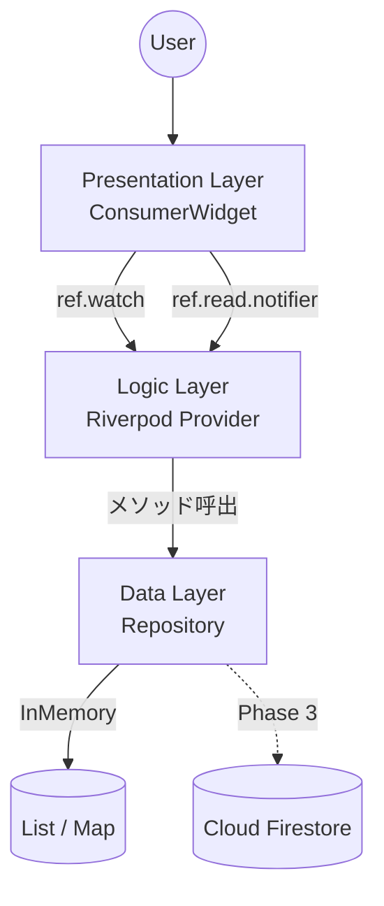
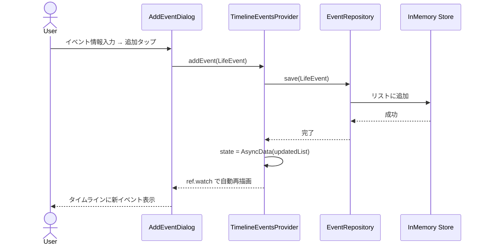

# ソフトウェアアーキテクチャ設計書

**Version**: 3.0
**Last Updated**: 2025-XX-XX
**Owner**: Architect Agent

## 1. 概要

本文書は、ライフプランアプリのソフトウェアアーキテクチャを定義する。
高いメンテナンス性、テスト容易性、拡張性を確保し、AIコーディングエージェントによる開発支援を効率化することを設計目標とする。

## 2. 設計思想

- **アーキテクチャスタイル**: レイヤードアーキテクチャ（3層）
- **設計原則**: 関心の分離（Separation of Concerns）
- **層構成**: Presentation（UI）→ Logic → Data

## 3. 技術スタック

> 詳細は `CLAUDE.md` セクション3を参照。ここでは設計に関わる選定理由を記述する。

| 技術 | 選定理由 |
|---|---|
| Riverpod v2 + Generator | コンパイル時のProvider型安全性。AIエージェントがコード生成しやすいアノテーションベース。 |
| GoRouter | 宣言的ルーティング。Deep Link対応。Web対応が容易。 |
| Freezed | イミュータブルなデータモデル。copyWith / == / toString の自動生成。 |
| mocktail | コード生成不要のモックライブラリ。AIエージェントとの相性良好。 |

## 4. レイヤー定義

### 4.1. Presentation層（UI Layer）
- **責務**: 画面描画とユーザー入力受付のみ。
- **構成**: `ConsumerWidget` / `ConsumerStatefulWidget`
- **ルール**:
  - `ref.watch()` でLogic層の状態を購読しUIを描画する。
  - ユーザー操作は `ref.read(provider.notifier).method()` でLogic層に通知する。
  - **ビジネスロジック（計算、データ通信、状態加工）を一切持たない。**

### 4.2. Logic層（Business Logic Layer）
- **責務**: 状態管理とビジネスロジック実行。
- **構成**: `@riverpod` アノテーションで生成されるProvider群
  - `AsyncNotifierProvider`: 非同期データ + ユーザー操作ロジック
  - `NotifierProvider`: 同期的な状態管理
- **ルール**:
  - UI層からの通知を受け、Data層のRepositoryを呼び出す。
  - Repositoryから受け取ったデータをUIが表示しやすい状態モデルに加工する。

### 4.3. Data層（Data Layer）
- **責務**: 外部データソースとのI/O。
- **構成**: Repositoryクラス + Provider
- **ルール**:
  - リポジトリパターンを実装する。
  - データ取得元の実装詳細をLogic層から隠蔽する。
  - MVP時はインメモリ実装。Phase 3でFirestore実装に差し替え。

## 5. ディレクトリ構造

```
lib/
├── main.dart                           # エントリポイント + ProviderScope
├── core/
│   ├── router/
│   │   └── app_router.dart             # GoRouter設定
│   ├── theme/
│   │   └── app_theme.dart              # ThemeData定義
│   └── constants/
│       └── app_constants.dart          # 文字数上限等の定数
└── features/
    ├── timeline/
    │   ├── data/
    │   │   └── event_repository.dart   # Repository（MVP: InMemory実装）
    │   ├── domain/
    │   │   └── life_event.dart         # @freezed データモデル
    │   ├── logic/
    │   │   └── timeline_events_provider.dart  # @riverpod 状態管理
    │   └── presentation/
    │       ├── timeline_screen.dart    # メイン画面
    │       └── widgets/
    │           ├── timeline_view.dart  # タイムライン描画
    │           ├── event_card.dart     # イベントカード
    │           └── add_event_dialog.dart # イベント追加ダイアログ
    └── profile/
        ├── data/
        │   └── profile_repository.dart
        ├── domain/
        │   └── user_profile.dart       # @freezed データモデル
        ├── logic/
        │   └── profile_provider.dart
        └── presentation/
            └── profile_dialog.dart
```

## 6. データフロー図

### 6.1. コンポーネント図



### 6.2. イベント追加シーケンス



## 7. 主要モデル定義（参考）

```dart
// life_event.dart
@freezed
class LifeEvent with _$LifeEvent {
  const factory LifeEvent({
    required String id,
    required String title,
    required EventType type,       // enum: work, private
    required DateTime startDate,
    DateTime? endDate,
    String? detail,
    WorkIconType? iconType,        // enum: join, careerUp, goal (Workのみ)
  }) = _LifeEvent;

  factory LifeEvent.fromJson(Map<String, dynamic> json) =>
      _$LifeEventFromJson(json);
}
```

## 変更履歴

| バージョン | 日付 | 変更内容 |
|---|---|---|
| 1.0 | - | 初版作成 |
| 2.0 | - | AI開発効率化を設計目標に追加 |
| 3.0 | - | Claude Code体制に合わせて再構成。ディレクトリ構造を具体化。モデル定義を追加。 |
